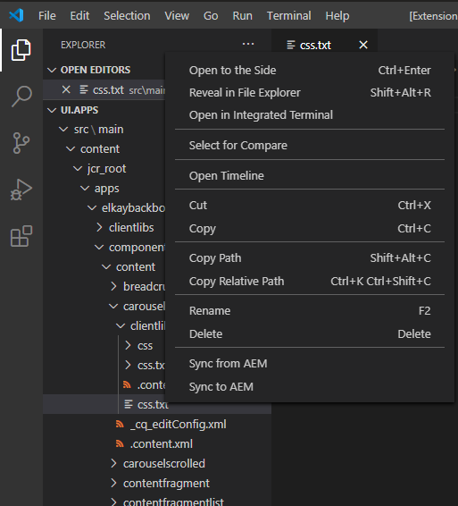

# AEM PowerSync README
AEM PowerSync is an extension for VSCode that allows you to sync files and folders between your local AEM instance and file system.

## Features
This extension was designed for AEM 6.5 local development on Windows 10.

Sync options at the bottom of the Explorer window context menu:

**Please, only use this extension for local AEM development.**

## Setup Configuration
Please follow all configuration steps before attempting to use this extension.  

### Software Dependencies
- [7z](https://www.7-zip.org/a/7z1900-x64.msi)
- [PowerShell 6+](https://github.com/PowerShell/PowerShell/releases)

### Set PATH variable for 7z
Get `7z` to work from your command line
- Install 7z from the link above
- Edit environment variables:
    - press **Windows Key** + **R**
    - enter `SystemPropertiesAdvanced`
    - click **Environment Variables...**
    - under **System variables** select **Path** and click **Edit...**
    - click **New** and enter the path to your 7z binaries
        - `c:\Program Files\7-Zip\`
- Click **OK** for all the open dialogues
- Open a new **cmd terminal** and enter `7z`
    - if the command is recognized, you should see a list of commands
    - you're **done!**
  
[More information on environment variables here.](https://support.microsoft.com/en-us/help/310519/how-to-manage-environment-variables-in-windows-xp)

### AEM localhost configuration
For the script to access the AEM APIs, you must update the following configurations.  
In [configMgr](http://localhost:4502/system/console/configMgr)  
- [Apache Sling Referrer Filter](http://localhost:4502/system/console/configMgr/org.apache.sling.security.impl.ReferrerFilter) => Enable allow empty, Remove POST
- [Adobe Granite CSRF Filter](http://localhost:4502/system/console/configMgr/com.adobe.granite.csrf.impl.CSRFFilter) => remove POST

**If you do not update these configurations, the script may delete folders/files from your filesystem**

### Unblock PowerShell Script [Conditional]
This extension uses a PowerShell script to manage AEM packages and code on your filesystem.  
The script is located at:  
`%USERPROFILE%\.vscode\extensions\aempowersync-X.X.X\aemsync.ps1`

Per Microsoft, I encourage you to read the contents of the script before unblocking the file or changing your execution policy.  
[You can read more here](https://docs.microsoft.com/en-us/powershell/module/microsoft.powershell.security/set-executionpolicy?view=powershell-7#example-7--unblock-a-script-to-run-it-without-changing-the-execution-policy)  

## Extension Settings
- aempowersync.powershell
    - Location of the PowerShell executable
    - default = `C:\\Program Files\\PowerShell\\6\\pwsh.exe`
- aempowersync.uri
    - AEM server uri as `https?://HOSTNAME:PORT`
    - default = `http://127.0.0.1:4502`
- aempowersync.credentials
    - AEM admin user credentials as `USERNAME:PASSWORD`
    - default = `admin:admin`
- aempowersync.healthcheck
    - AEM healthcheck endpoint as url path
    - default = `/libs/granite/core/content/login.html`

## Known Issues
- Syncing `.content.xml` files **to AEM** does not work; you must sync the parent folder
    - `.content.xml` from AEM = enabled
    - `.content.xml` to AEM = disabled
    - `_cq_editConfig.xml` from/to AEM = disabled
    - `_cq_template/` from/to AEM = disabled
